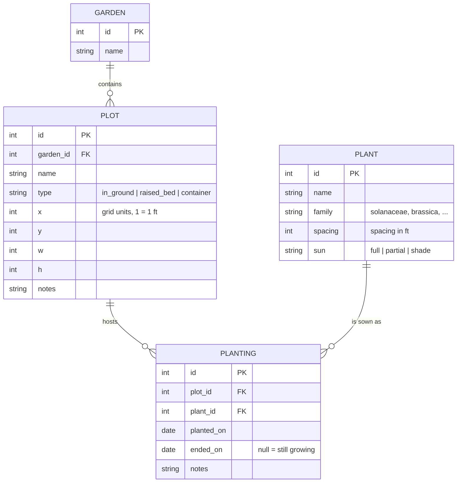

# Pixel Plot — Garden Management Web App

Single-container web app for laying out garden plots on a 2D grid, tracking what's planted where, and reasoning about crop rotation across seasons.

## Goals & Success Criteria

| # | Goal | Done when |
|---|------|-----------|
| 1 | Persistent SQL storage for historical tracking | All plot/planting data survives restarts; can query "what grew in bed 3 in 2025" and get rotation warnings |
| 2 | Interactive web UI | Drag/create/resize/color plots on a pan-zoom canvas; click a plot to plant/harvest; works in a browser without install |
| 3 | Docker deploy, then Cloud Run | `docker compose up` serves a working app locally with a named volume; same image deploys to Cloud Run and persists data |
| 4 | Fun stack | Modern, minimal, one language end-to-end, hot reload during dev |
| 5 | Low running cost | Hosted footprint < $2/mo: scale-to-zero compute + <$1/mo storage, no always-on paid services |

## Recommended Stack

One TypeScript codebase, full-stack.

| Layer | Choice | Why |
|-------|--------|-----|
| Framework | SvelteKit (TS) + `adapter-node` | Hot reload, small bundle, server routes + UI in one repo; produces a plain Node server that Dockerizes trivially |
| UI styling | Tailwind CSS | Fast to style the editor chrome; skip if plain CSS preferred |
| Canvas | Custom HTML5 `<canvas>` renderer | The plot editor is the heart of the app; a hand-rolled grid renderer is ~200 lines and avoids heavyweight libs |
| DB access | Drizzle ORM | Typed queries, first-class SQLite and Postgres support — lets storage swap without a rewrite |
| Database (local) | SQLite file on a Docker named volume | Zero-config, file-based, perfect for single-user local use |
| Database (hosted) | SQLite + Litestream → GCS | Same SQLite file everywhere; sidecar replicates continuously to a GCS bucket — <$1/mo, no dialect swap |
| Runtime | Node 22 LTS | Boring deploys; Cloud Run's Node image support is first-class |

Alternatives considered:
- **Go + HTMX**: tiny image, also fun; more code for interactive canvas state.
- **Bun**: faster dev loop; Cloud Run support still friction compared to Node.
- **Cloud SQL Postgres**: the "standard" Cloud Run story, but ~$10+/mo minimum for an always-on instance — pays for reliability a low-use hobby app doesn't need. Kept as fallback if Litestream restore proves flaky.

## Storage Decision (cost-capped: target < $2/mo)

Cloud Run filesystems are ephemeral, so storage must live outside the container. This is a low-use hobby app, so cost is a hard constraint:

| Option | ~Cost/mo | Verdict |
|--------|----------|---------|
| SQLite + Litestream → GCS | <$1 | **Chosen.** Litestream sidecar streams the SQLite file to a GCS bucket (a few MB = pennies). Cloud Run supports multi-container revisions; instance scales to zero, restores latest replica on wake. |
| Cloud SQL Postgres | $10+ | Solid, but overkill for this usage level; fallback only |
| Filestore NFS | $200+ | Explicitly ruled out |

Consequences:
- SQLite end-to-end — no dialect swap, forever. Drizzle still used for typed queries + migrations.
- Cloud Run pinned to `--max-instances=1`: Litestream is single-writer, and low traffic means the cap costs nothing.
- Litestream only runs in the hosted revision. Local dev stays simple: SQLite file on a Docker named volume. When cutting over to the cloud, the local DB is pushed once and Litestream takes it from there.

## Data Model

- `planting` rows are never deleted — harvesting sets `ended_on`. That is the historical record.
- Crop rotation = group `planting` by `plant.family` per `plot` per year; warn when a plot repeats a family two years running.
- Multi-garden: garden switcher in the top bar, canvas shows one garden at a time. `PLANT` is a global seed catalog shared across gardens.
- Units: 1 grid square = 1 ft (a standard 4x8 raised bed = 32 squares).

## Phases

### Phase 0 — Scaffold (~1h)
- [x] `npx sv create` (or `npm create svelte@latest`) with TS, then git init
- [x] Tailwind, Drizzle, better-sqlite3 deps
- [x] `docker-compose.yml` skeleton (app + named volume for `data/pixel.db`)
- [x] Confirm: `npm run dev` serves localhost:5173

### Phase 1 — Data layer (~2h)
- [x] Drizzle schema for `garden`, `plot`, `plant`, `planting` (migrations via `drizzle-kit`)
- [x] Seed data: common garden plants with families (tomato→solanaceae, kale→brassica, etc.)
- [x] Server routes (CRUD): gardens, plots, plant catalog, plantings
- [x] Vitest: planting lifecycle (plant → harvest), rotation-warning query

### Phase 2 — Plot editor canvas (~4h)
- [x] Garden switcher in top bar (create/select/rename gardens)
- [x] Grid render: pan (drag) + zoom (wheel), snap to grid (1 sq = 1 ft)
- [x] Create plot: drag empty area → dialog (name/type/size)
- [x] Select/move/resize/delete existing plots; color per plant family
- [x] Persist positions through API; reload shows same layout
- [x] Acceptance: two gardens with 6 beds in the main one, reload browser, both layouts intact

### Phase 3 — Planting & rotation (~4h)
- [x] Click plot → plant (pick from catalog, quantity/spacing) → shows crop icon/color fill
- [x] Harvest/end planting action; plot returns to empty
- [x] Date slider: scrub any date to replay what was planted where
- [x] Rotation warning badge: "bed 3 had brassicas last year"
- [x] Acceptance: full season tracked end-to-end; rotation warnings correct on seeded data

### Phase 4 — Docker local deploy (~1h)
- [ ] Multi-stage Dockerfile: build SvelteKit → slim node runtime, volume-mounted `data/`
- [ ] `docker compose up` → app at localhost:3000, survives `docker compose down/up`
- [ ] README with run instructions

### Phase 5 — Cloud Run (~2h; GCP project + billing ready; budget <$2/mo)
- [ ] GCS bucket for Litestream replicas (standard storage; DB is a few MB ≈ pennies)
- [ ] Multi-container revision: app container + litestream sidecar sharing an ephemeral volume
- [ ] Startup: sidecar restores latest replica before app serves; `--max-instances=1` (single writer)
- [ ] Push image to Artifact Registry; `gcloud run deploy` with a service account scoped to the bucket
- [ ] Verify: add a plot → force revision restart → data intact; sanity-check projected monthly cost
- [ ] Custom domain (optional)

### Phase 6 — Stretch (pick later)
- Weather/frost-date integration (free NOAA-ish API)
- Watering schedule view
- PNG/PDF export of garden map
- Auth (Cloud Run IAP instead of rolling our own)

## Testing & Verification Strategy

- Vitest for data-layer + rotation logic and the full API lifecycle (12 tests).
- Browser-automation smoke: create garden → drag-create plot → plant → harvest → slider replay → reload/restart persistence. All exercised against the running app.

## Decisions (resolved)

| Question | Decision |
|----------|----------|
| Garden scope | **Multi-garden** from day one (garden switcher) |
| Units | **1 grid square = 1 ft** |
| History UI | **Date slider** scrubbing |
| GCP | Project + billing **ready**; deploy at Phase 5 |
