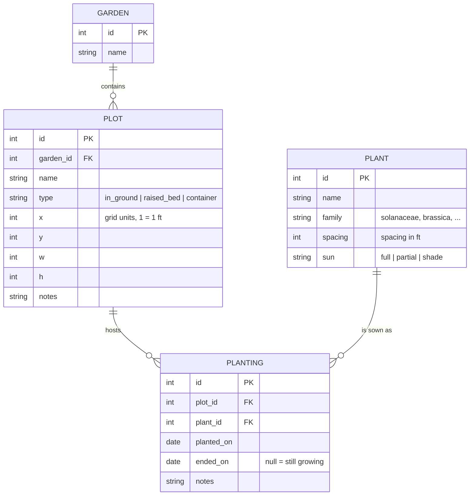

# Pixel Plot — Garden Management Web App

Single-container web app for laying out garden plots on a 2D grid, tracking what's planted where, and reasoning about crop rotation across seasons.

## Goals & Success Criteria

| # | Goal | Done when |
|---|------|-----------|
| 1 | Persistent SQL storage for historical tracking | All plot/planting data survives restarts; can query "what grew in bed 3 in 2025" and get rotation warnings |
| 2 | Interactive web UI | Drag/create/resize/color plots on a pan-zoom canvas; click a plot to plant/harvest; works in a browser without install |
| 3 | Docker deploy, then Cloud Run | `docker compose up` serves a working app locally with a named volume; same image deploys to Cloud Run and persists data |
| 4 | Fun stack | Modern, minimal, one language end-to-end, hot reload during dev |
| 5 | Low running cost | Hosted footprint < $2/mo: scale-to-zero compute + <$1/mo storage, no always-on paid services |

## Recommended Stack

One TypeScript codebase, full-stack.

| Layer | Choice | Why |
|-------|--------|-----|
| Framework | SvelteKit (TS) + `adapter-cloudflare` | Hot reload, small bundle, server routes + UI in one repo; deploys as a Workers static-assets site |
| UI styling | Tailwind CSS | Fast to style the editor chrome; skip if plain CSS preferred |
| Canvas | Custom HTML5 `<canvas>` renderer | The plot editor is the heart of the app; a hand-rolled grid renderer is ~200 lines and avoids heavyweight libs |
| DB access | Drizzle ORM (`drizzle-orm/d1`) | Typed queries; D1 speaks SQLite dialect, queries stay async |
| Database (local) | Local D1 via wrangler platform proxy | `npm run dev` serves the same `cloudflare:workers` binding against a local SQLite in `.wrangler/state/` — no account needed |
| Database (hosted) | Cloudflare D1 | Serverless SQLite, free tier, managed 7–30 day point-in-time restore (Time Travel); no backup sidecar |
| Runtime | workerd (Cloudflare Workers) | Scale-to-zero by default; free tier covers hobby traffic |

Alternatives considered:
- **Cloud Run + Litestream→GCS** (shipped at Phase 5, later superseded): same SQLite file everywhere, but a sidecar to babysit, a restore race on cold starts, and a single-writer instance cap. Workers + D1 removes all three for $0/mo with managed Time Travel; the migration cost was the async data layer (sync `better-sqlite3` → async D1 driver).
- **Go + HTMX**: tiny image, also fun; more code for interactive canvas state.
- **Cloud SQL Postgres**: the "standard" Cloud Run story, but ~$10+/mo minimum — pays for reliability a low-use hobby app doesn't need.

## Storage Decision (cost-capped: target < $2/mo)

| Option | ~Cost/mo | Verdict |
|--------|----------|---------|
| Cloudflare D1 | $0 | **Chosen (cutover).** Serverless SQLite on Workers; free tier (5M reads + 100k writes/day, 5 GB) dwarfs hobby traffic; 7-day Time Travel (30 on paid) replaces Litestream entirely. |
| SQLite + Litestream → GCS | <$1 | Shipped at Phase 5, verified (cold-restart restore proven), then superseded by D1 to eliminate the sidecar + restore race. |
| Cloud SQL Postgres | $10+ | Overkill for this usage level. |
| Filestore NFS | $200+ | Explicitly ruled out. |

Consequences:
- SQLite dialect end-to-end — Drizzle `d1` driver everywhere; every query async.
- Migrations authored by drizzle-kit (`drizzle/`, seed as `0001_seed.sql`), applied by `wrangler d1 migrations apply` (local + remote); one-off port files live in `scripts/`, never in `migrations_dir` (wrangler applies every `.sql` there, alphabetically).
- No instance cap, no volume, no bucket, no sidecar. Dev/prod share the same binding via the platform proxy.

## Data Model

- `planting` rows are never deleted — harvesting sets `ended_on`. That is the historical record.
- Crop rotation = group `planting` by `plant.family` per `plot` per year; warn when a plot repeats a family two years running.
- Multi-garden: garden switcher in the top bar, canvas shows one garden at a time. `PLANT` is a global seed catalog shared across gardens.
- Units: 1 grid square = 1 ft (a standard 4x8 raised bed = 32 squares).

## Phases

### Phase 0 — Scaffold (~1h)
- [x] `npx sv create` (or `npm create svelte@latest`) with TS, then git init
- [x] Tailwind, Drizzle, better-sqlite3 deps
- [x] `docker-compose.yml` skeleton (app + named volume for `data/pixel.db`)
- [x] Confirm: `npm run dev` serves localhost:5173

### Phase 1 — Data layer (~2h)
- [x] Drizzle schema for `garden`, `plot`, `plant`, `planting` (migrations via `drizzle-kit`)
- [x] Seed data: common garden plants with families (tomato→solanaceae, kale→brassica, etc.)
- [x] Server routes (CRUD): gardens, plots, plant catalog, plantings
- [x] Vitest: planting lifecycle (plant → harvest), rotation-warning query

### Phase 2 — Plot editor canvas (~4h)
- [x] Garden switcher in top bar (create/select/rename gardens)
- [x] Grid render: pan (drag) + zoom (wheel), snap to grid (1 sq = 1 ft)
- [x] Create plot: drag empty area → dialog (name/type/size)
- [x] Select/move/resize/delete existing plots; color per plant family
- [x] Persist positions through API; reload shows same layout
- [x] Acceptance: two gardens with 6 beds in the main one, reload browser, both layouts intact

### Phase 3 — Planting & rotation (~4h)
- [x] Click plot → plant (pick from catalog, quantity/spacing) → shows crop icon/color fill
- [x] Harvest/end planting action; plot returns to empty
- [x] Date slider: scrub any date to replay what was planted where
- [x] Rotation warning badge: "bed 3 had brassicas last year"
- [x] Acceptance: full season tracked end-to-end; rotation warnings correct on seeded data

### Phase 4 — Docker local deploy (superseded by Phase 6)
- [x] Multi-stage Dockerfile + `docker compose up` with named volume — worked, later removed with the Workers cutover

### Phase 5 — Cloud Run (superseded by Phase 6)
- [x] GCS bucket + Litestream sidecar + `--max-instances=1`; cold-restart restore verified end-to-end — later removed with the Workers cutover

### Phase 6 — Workers + D1 cutover
- [x] adapter-cloudflare + wrangler config; drop Docker/Cloud Run/Litestream
- [x] Data layer async: `drizzle-orm/d1`, `env.DB` via `cloudflare:workers`; dev = platform proxy, tests = ephemeral proxy
- [x] Migrations + seed applied by wrangler (`drizzle/0001_seed.sql`)
- [x] 12/12 tests green against real D1 SQL; local browser smoke verified
- [x] `wrangler deploy` to workers.dev — https://pixel-plot.pixel-plot.workers.dev (cert provisioning lag ~2 min on first deploy)
- [x] Ported Cloud Run data (Cloud Garden) into D1 via `scripts/port-cloud-run.sql`; live API + UI verified; Cloud Run/GCS/AR deleted
- [ ] Auth (Cloudflare Access in front of the worker instead of rolling our own)

### Phase 7 — Stretch (pick later)
- Weather/frost-date integration (free NOAA-ish API)
- Watering schedule view
- PNG/PDF export of garden map

## Testing & Verification Strategy

- Vitest for data-layer + rotation logic and the full API lifecycle (12 tests).
- Browser-automation smoke: create garden → drag-create plot → plant → harvest → slider replay → reload/restart persistence. All exercised against the running app.

## Decisions (resolved)

| Question | Decision |
|----------|----------|
| Garden scope | **Multi-garden** from day one (garden switcher) |
| Units | **1 grid square = 1 ft** |
| History UI | **Date slider** scrubbing |
| GCP | Project + billing **ready**; deployed at Phase 5 (Cloud Run + Litestream) |
| Hosting | **Cloudflare Workers + D1** (Phase 6 cutover): $0/mo, managed Time Travel, no sidecar; Cloud Run/GCS/AR torn down |
